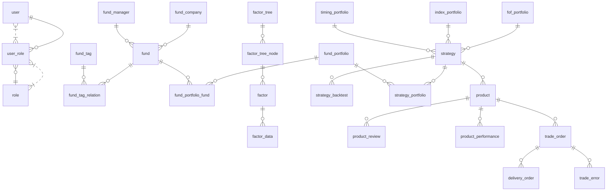

# 智能投顾系统主要接口与数据库设计

---

## 一、主要接口设计

### 1. 基金研究子系统
- GET    /api/funds                      # 获取全部基金列表（分页、筛选、标签）
- GET    /api/funds/{fundId}             # 查询单只基金详情
- GET    /api/fund-tags                  # 获取所有基金标签
- GET    /api/fund-companies             # 基金公司列表（支持筛选）
- GET    /api/fund-managers              # 基金经理列表（支持筛选）
- POST   /api/fund-portfolios            # 创建基金组合
- GET    /api/fund-portfolios/{id}       # 获取基金组合详情
- POST   /api/fund-portfolios/save-from-filter # 保存筛选结果为组合
- GET    /api/funds/{fundId}/profile     # 获取基金画像

### 2. 因子管理子系统
- GET    /api/factors                    # 获取因子列表
- POST   /api/factors                    # 新增因子
- GET    /api/factors/{factorId}         # 获取因子详情
- GET    /api/factor-trees               # 获取因子树结构
- POST   /api/factor-trees               # 新建因子树
- POST   /api/factors/derived            # 新建衍生因子
- POST   /api/factors/style              # 新建风格投资因子
- POST   /api/factors/import             # 因子数据接入

### 3. 策略管理子系统
- GET    /api/strategies                 # 策略列表
- POST   /api/strategies                 # 新建策略
- GET    /api/strategies/{id}            # 策略详情
- POST   /api/strategies/{id}/backtest   # 策略回测
- POST   /api/strategies/{id}/simulate   # 策略模拟
- POST   /api/strategies/{id}/rebalance  # 策略再平衡
- GET    /api/strategies/{id}/monitor    # 策略监控
- POST   /api/fof-portfolios             # 创建FOF组合
- POST   /api/index-portfolios           # 创建基金指数组合
- POST   /api/timing-portfolios          # 创建择时组合

### 4. 组合产品管理子系统
- GET    /api/products                   # 组合产品列表
- POST   /api/products                   # 新建组合产品
- GET    /api/products/{id}              # 组合产品详情
- POST   /api/products/{id}/review       # 组合上架审核
- GET    /api/products/{id}/performance  # 组合收益情况

### 5. 交易管理子系统
- POST   /api/trades/rebalance           # 组合调仓
- POST   /api/trades/error-handling      # 差错处理
- POST   /api/trades/account-rebalance   # 账户调仓
- GET    /api/trade-orders               # 交易单列表
- POST   /api/trade-orders/{id}/action   # 交易单操作
- GET    /api/delivery-orders            # 交割单列表
- GET    /api/delivery-orders/{id}       # 交割单详情

---

## 二、核心数据库表设计

### 1. 用户与权限
- user（用户表）
- role（角色表）
- user_role（用户角色关联表）

### 2. 基金研究
- fund（基金表）
- fund_tag（基金标签表）
- fund_tag_relation（基金与标签关联表）
- fund_company（基金公司表）
- fund_manager（基金经理表）
- fund_portfolio（基金组合表）
- fund_portfolio_fund（组合与基金关联表）

### 3. 因子管理
- factor（因子表）
- factor_tree（因子树表）
- factor_tree_node（因子树节点表）
- factor_data（因子数据表）

### 4. 策略管理
- strategy（策略表）
- strategy_backtest（策略回测表）
- strategy_portfolio（策略与组合关联表）
- fof_portfolio（FOF组合表）
- index_portfolio（基金指数组合表）
- timing_portfolio（择时组合表）

### 5. 组合产品管理
- product（组合产品表）
- product_review（产品审核表）
- product_performance（产品收益表）

### 6. 交易管理
- trade_order（交易单表）
- delivery_order（交割单表）
- trade_error（差错处理表）

---

## 三、ER图（Mermaid语法）

---

如需详细字段设计或某一模块的详细ER图，请随时告知！ 