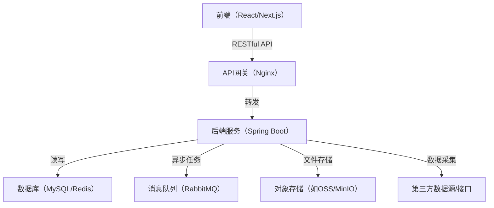

# 智能投顾系统Web端项目文档

---

## 一、项目简介

本项目为智能投顾系统Web端，旨在为用户提供全面的基金研究、因子管理、策略管理、组合产品管理和交易管理等功能，助力金融投资决策的智能化、自动化。

---

## 二、技术选型

### 1. 前端
- 框架：React（推荐Next.js）
- UI组件库：Ant Design
- 状态管理：Redux Toolkit 或 Recoil
- 数据请求：Axios 或 React Query
- 可视化：ECharts 或 AntV G2
- 路由管理：React Router（如不用Next.js自带路由）
- 表单处理：Formik + Yup
- 开发工具：VSCode + Cursor

### 2. 后端
- 框架：Spring Boot
- 数据库：MySQL、Redis
- ORM：MyBatis 或 JPA
- 安全：Spring Security + JWT
- 接口文档：Swagger3（OpenAPI）
- 定时任务：Quartz
- 消息队列：RabbitMQ（如需异步处理）
- 开发工具：IntelliJ IDEA

### 3. 其他
- 版本管理：Git + GitHub/Gitee
- 部署：Docker + Nginx
- CI/CD：GitHub Actions 或 Jenkins

---

## 三、系统架构

- 前后端分离，RESTful API 交互
- 后端分层架构（Controller-Service-DAO）
- 可扩展为微服务架构
- 统一权限与安全管理

### 架构图（Mermaid语法）



---

## 四、主要功能模块

### 1. 基金研究子系统
- 全部公募基金查询、筛选、标签管理、基金组合创建与保存
- 基金公司、基金经理维度查询
- 基金画像展示

### 2. 因子管理子系统
- 因子查询、接入、因子树管理
- 衍生因子、风格投资因子创建与管理

### 3. 策略管理子系统
- 资产配置策略、FOF组合、基金指数组合、择时组合
- 策略详情、回测、模拟、再平衡、监控预警

### 4. 组合产品管理子系统
- 组合上架审核、组合产品创建、组合详情展示

### 5. 交易管理子系统
- 组合调仓、差错处理、账户调仓
- 交易单管理、交割单管理

---

## 五、开发流程建议

1. 需求梳理与接口设计（Swagger/OpenAPI）
2. 数据库设计（ER图、表结构）
3. 后端代码实现（分层架构、单元测试）
4. 前端页面开发（UI原型、组件开发、接口对接）
5. 联调测试与优化
6. 部署上线与运维

---

## 六、目录结构建议

```
NEU_lab/
├── backend/           # 后端Spring Boot项目
├── frontend/          # 前端React项目
├── docs/              # 项目文档
│   ├── 01_项目简介.md
│   ├── 02_需求分析.md
│   ├── 03_技术选型.md
│   ├── 04_系统架构.md
│   ├── 05_数据库设计.md
│   ├── 06_接口文档.md
│   ├── 07_前端设计.md
│   ├── 08_后端设计.md
│   ├── 09_部署说明.md
│   └── 10_开发规范.md
└── README.md
```

---

## 七、后续可细化内容
- 数据库ER图与表结构设计
- 详细接口文档（Swagger/OpenAPI）
- 前端页面原型与交互流程
- 代码规范与开发约定

如需进一步细化某一部分，请随时告知！ 