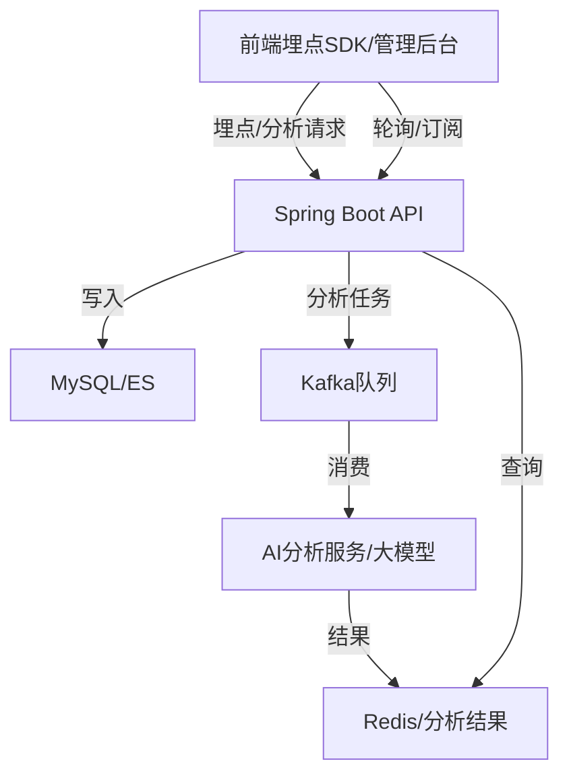

# 智能投顾系统项目文档

## 1. 项目简介
智能投顾系统，基于Spring Boot + React，前后端分离，支持基金、因子、策略、产品、交易、用户等核心业务。
目标：实现自动化投顾、全链路埋点、数据分析、用户画像、分群、管理后台可视化。

**行业痛点**：传统理财门槛高、服务同质化、缺乏个性化推荐，用户投资体验不佳。
**智能投顾优势**：自动化资产配置、风险评估、智能推荐，提升投资效率与安全性。
**本项目定位**：面向中小投资者，提供一站式基金投资、策略组合、智能分析与可视化管理。

## 2. 系统架构
- 架构图（Kafka异步链路版）

- 前端：React + Ant Design，模块化开发，统一UI风格。
- 后端：Spring Boot，JPA/Hibernate，MySQL，Kafka 消息队列，RESTful API，JWT鉴权。
- 分层设计：Controller-Service-Repository，前端 pages/components/api/store/router/utils。

**微服务可扩展性**：后端采用分层架构，便于未来拆分为微服务。
**安全机制**：JWT+权限注解+接口拦截，防止未授权访问。
**埋点体系**：前端全埋点+后端行为日志，支持用户行为全链路追踪。
**数据分析链路**：埋点数据实时入库，分析任务异步投递Kafka，由AI分析服务消费，结果写入Redis/数据库，前端轮询/订阅获取。
**高可用设计**：数据库主从、接口限流、异常监控，保障系统稳定。

## 3. 主要功能模块
### 3.1 用户与权限管理
- 用户注册、登录、个人中心、角色权限（管理员/普通用户）
- 支持邮箱/手机号注册，密码加密存储。
- 角色分级（管理员/普通用户），支持动态切换。
- 个人中心：信息修改、投资偏好设置、历史操作查询。
### 3.2 基金与产品管理
- 基金、基金公司、基金经理、基金组合、产品、产品审核、业绩管理
- 基金信息、公司、经理、组合全链路管理。
- 产品审核流：新产品需管理员审核后上架。
- 业绩统计：支持按时间、类型、组合多维度查询。
### 3.3 策略与因子管理
- 策略列表、详情、编辑、回测，因子树、风格因子、复合因子
- 策略可回测、编辑、复制，支持多因子组合。
- 因子树结构，支持风格因子、复合因子管理。
- 策略与产品、用户投资行为联动。
### 3.4 交易与持仓管理
- 交易单、交割单、资金流水、用户持仓、差错处理、调仓
- 下单、风控、撮合、交割全流程自动化。
- 差错处理：异常订单自动告警，支持人工干预。
- 用户持仓、收益、调仓、赎回实时同步。
### 3.5 数据埋点与行为分析
- 前端全链路埋点，后端采集、存储，实时/历史统计，用户画像、分群
- 前端自动埋点，采集页面访问、点击、投资行为等。
- 后端统一日志表，支持实时/历史行为分析。
- 用户画像、分群标签自动生成，驱动个性化推荐。
- 埋点数据写入数据库的同时，分析任务异步投递Kafka，由AI分析服务消费，分析结果写入Redis/数据库，前端通过轮询/订阅获取。
### 3.6 管理后台与数据可视化
- 实时统计、分群分析、用户画像、大模型摘要、权限控制
- 实时统计大盘、分群分析、用户画像可视化。
- 支持批量审核、调仓、权限分配、异常监控。
- 大模型摘要：自动生成业务洞察与运营建议。

## 4. 关键技术实现
- 统一响应结构 `{ code, message, data }`
- RESTful接口设计
- JWT鉴权与权限校验
- 全链路埋点体系（trackEvent、user_event_log表）
- 数据分析接口（/api/analytics/realtime、/api/user-profile/{userId}等）
- 前端美观交互（Ant Design、表格筛选、弹窗、Tag美化）
- Kafka 消息队列：实现埋点数据、AI分析等任务的异步解耦，提升系统响应速度与可扩展性。
- Spring Boot 集成 Kafka，支持生产/消费消息，任务状态追踪。

**统一异常处理**：全局异常捕获，前后端一致的错误码与提示。
**接口幂等性**：关键操作（如下单、审核）支持幂等校验，防止重复提交。
**数据脱敏**：敏感信息（如手机号、邮箱）接口返回自动脱敏。
**埋点SDK**：前端自研埋点SDK，支持自定义事件、属性、批量上报。
**权限注解**：后端基于注解的权限校验，简化开发与维护。
**数据可视化**：前端Echarts/AntV，支持多维度交互式分析。

## 5. 业务流程
- 用户注册/登录/权限切换
- 基金/产品/策略/因子/交易等核心业务操作
- 埋点数据采集与分析
- 管理后台数据可视化与大模型摘要
- 异常处理与权限控制
- 埋点数据采集后，分析任务异步入Kafka，AI服务消费后写入结果，前端轮询获取分析结论。

**注册-登录-权限切换**：演示不同角色的页面与权限差异。
**基金/产品/策略全流程**：从浏览、筛选、对比、收藏到投资下单。
**策略回测与应用**：用户可自定义策略并一键回测，结果可视化展示。
**埋点与画像**：实时查看用户行为数据、画像与分群标签变化。
**异常与安全**：演示接口权限校验、异常订单处理、操作日志追溯。

## 6. 数据库设计
- 主要表结构（用户、基金、产品、交易、埋点日志、画像、分群、分析任务等）
- 设计规范（主键id、时间戳、外键、字段命名）
- ER图（建议插图）

**主表设计**：用户表、基金表、产品表、策略表、交易表、埋点日志表、画像表、分群表、分析任务表等。
**字段规范**：所有表主键自增，时间戳自动维护，外键约束完整。
**ER图**：建议用 Mermaid 或 PowerDesigner 绘制，突出主外键关系。
**数据隔离**：不同角色、不同用户数据隔离，防止越权访问。
**操作日志**：所有敏感操作（如调仓、审核）均有日志记录，便于审计。

**分析任务表设计建议**：
| 字段名         | 类型         | 说明           |
| -------------- | ------------ | -------------- |
| id             | bigint PK    | 主键           |
| task_id        | varchar(64)  | 任务ID         |
| user_id        | bigint       | 用户ID         |
| status         | varchar(16)  | 任务状态（待处理/处理中/已完成/失败） |
| request_data   | text         | 分析请求数据   |
| result_data    | text         | 分析结果（summary/advice等） |
| error_msg      | text         | 失败原因       |
| created_at     | datetime     | 创建时间       |
| updated_at     | datetime     | 更新时间       |

## 7. 安全与权限
- 接口权限校验
- 数据隔离
- 操作日志
- 异常处理

## 8. 项目亮点与创新
- 全链路埋点与行为分析（Kafka异步解耦）
- 管理后台可视化与大模型洞察
- 业务分层清晰、代码规范
- 多角色权限、批量操作、异常处理

**全链路埋点闭环**：从前端采集到后端分析、Kafka异步处理、再到可视化与推荐，形成数据驱动业务的闭环。
**大模型洞察**：集成大模型（如ChatGPT）自动生成用户行为摘要、投资建议。
**批量操作与自动化**：支持批量审核、批量调仓、自动风控，提升运营效率。
**多角色协同**：管理员、普通用户、风控专员等多角色协同，权限灵活可配。
**高可用与安全**：接口限流、异常监控、数据脱敏，保障系统稳定与数据安全。

## 9. 总结与展望
- 已实现功能
- 后续可扩展方向（大模型、更多金融产品、智能推荐等）
- 团队协作与开发收获

**已实现**：核心业务、全链路埋点、数据分析、可视化、权限控制、异常处理。
**可扩展方向**：
  - 引入更多金融产品（如债券、ETF等）
  - 集成第三方行情与风控服务
  - 深化大模型智能推荐与自动化运营
  - 移动端适配与小程序扩展
  - 多租户与企业级权限体系

## 10. 附录
- 架构图、ER图、页面截图、埋点流程图
- 关键代码片段
- 演示视频/动图 