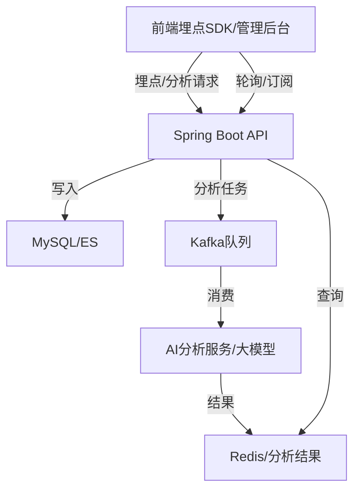

# 智能投顾系统项目演示PPT文案

---

## 1. 项目背景与目标

**标题**
项目背景与目标

**主内容**
- 金融科技推动了智能投顾（Robo-Advisor）在资产管理行业的广泛应用。
- 本项目旨在打造一套智能投顾平台，涵盖基金、因子、策略、产品、交易、用户等核心业务。
- 实现全链路用户行为埋点、数据分析、用户画像、分群与管理后台可视化，提升业务自动化和数据驱动能力。

**配图建议**
- 行业趋势图、智能投顾市场规模图

**拓展说明**
- 行业痛点：传统理财门槛高、服务同质化、缺乏个性化推荐，用户投资体验不佳。
- 智能投顾优势：自动化资产配置、风险评估、智能推荐，提升投资效率与安全性。
- 本项目定位：面向中小投资者，提供一站式基金投资、策略组合、智能分析与可视化管理。

---

## 2. 系统架构与技术选型

**标题**
系统架构与技术选型

**主内容**
- 前后端分离架构：Spring Boot（后端）+ React（前端）
- 后端：Spring Boot、JPA/Hibernate、MySQL、Kafka 消息队列、JWT鉴权、RESTful API
- 前端：React、Ant Design、React Router、Axios
- 其他：全链路埋点、数据可视化、权限控制、分层开发
- 引入 Kafka 消息队列，实现埋点与AI分析任务异步解耦，提升系统吞吐与可扩展性。

**配图建议**
- 系统整体架构图（Kafka异步链路版）

**拓展说明**
- 微服务可扩展性：后端采用分层架构，便于未来拆分为微服务。
- 安全机制：JWT+权限注解+接口拦截，防止未授权访问。
- 埋点体系：前端全埋点+后端行为日志，支持用户行为全链路追踪。
- 数据分析链路：埋点数据实时入库，分析任务异步投递Kafka，由AI分析服务消费，结果写入Redis/数据库，前端轮询/订阅获取。
- 高可用设计：数据库主从、接口限流、异常监控，保障系统稳定。

---

## 3. 主要功能模块

**标题**
主要功能模块

**主内容**
- 用户与权限管理：注册、登录、个人中心、角色权限
- 基金与产品管理：基金、基金公司、基金经理、基金组合、产品、产品审核
- 策略与因子管理：策略列表、回测、编辑、因子树、风格因子
- 交易与持仓管理：交易单、交割单、资金流水、用户持仓、差错处理
- 数据埋点与行为分析：全链路埋点、后端采集、实时/历史统计、用户画像、分群（Kafka异步分析链路）
- 管理后台与数据可视化：实时统计、分群分析、大模型摘要、权限控制

**配图建议**
- 主要页面截图、功能结构图

**拓展说明**
- 用户与权限管理：支持邮箱/手机号注册，密码加密存储，角色分级（管理员/普通用户），个人中心信息修改、投资偏好设置、历史操作查询。
- 基金与产品管理：基金信息、公司、经理、组合全链路管理，产品审核流，业绩统计多维度查询。
- 策略与因子管理：策略可回测、编辑、复制，支持多因子组合，因子树结构，策略与产品、用户投资行为联动。
- 交易与持仓管理：下单、风控、撮合、交割全流程自动化，异常订单自动告警，用户持仓、收益、调仓、赎回实时同步。
- 数据埋点与行为分析：前端自动埋点，后端统一日志表，用户画像、分群标签自动生成，埋点数据与AI分析链路异步化，支持高并发与大模型慢响应场景。
- 管理后台与数据可视化：实时统计大盘、分群分析、用户画像可视化，批量审核、调仓、权限分配、异常监控，大模型摘要。

---

## 4. 关键技术实现

**标题**
关键技术实现

**主内容**
- 统一响应结构：所有接口返回 `{ code, message, data }`
- RESTful接口设计：路径规范、方法语义清晰
- JWT鉴权与权限校验：前端token、后端统一校验
- 全链路埋点体系：前端`trackEvent`、后端`user_event_log`表
- 数据分析接口：如`/api/analytics/realtime`、`/api/user-profile/{userId}`
- 前端美观交互：Ant Design、表格筛选、弹窗、Tag美化
- Kafka 消息队列异步解耦，Spring Boot Kafka 集成，任务状态追踪。

**配图/代码建议**
- 关键接口响应示例、埋点流程图、部分核心代码片段

**拓展说明**
- 统一异常处理：全局异常捕获，前后端一致的错误码与提示。
- 接口幂等性：关键操作（如下单、审核）支持幂等校验，防止重复提交。
- 数据脱敏：敏感信息（如手机号、邮箱）接口返回自动脱敏。
- 埋点SDK：前端自研埋点SDK，支持自定义事件、属性、批量上报。
- 权限注解：后端基于注解的权限校验，简化开发与维护。
- 数据可视化：前端Echarts/AntV，支持多维度交互式分析。

---

## 5. 业务流程与演示场景

**标题**
业务流程与演示场景

**主内容**
- 用户注册/登录/权限切换
- 基金/产品/策略/因子/交易等核心业务操作
- 埋点数据采集与分析页面演示（Kafka异步分析链路）
- 管理后台数据可视化与大模型摘要
- 异常处理与权限控制演示

**配图/动图建议**
- 典型业务流程图、页面操作动图/截图

**拓展说明**
- 注册-登录-权限切换：演示不同角色的页面与权限差异。
- 基金/产品/策略全流程：从浏览、筛选、对比、收藏到投资下单。
- 策略回测与应用：用户可自定义策略并一键回测，结果可视化展示。
- 埋点与画像：实时查看用户行为数据、画像与分群标签变化，分析任务异步入Kafka，AI服务消费后写入结果，前端轮询获取分析结论。
- 异常与安全：演示接口权限校验、异常订单处理、操作日志追溯。

---

## 6. 数据库设计与安全

**标题**
数据库设计与安全

**主内容**
- 主要表结构：用户、基金、产品、交易、埋点日志、画像、分群、分析任务等
- 设计规范：主键id、时间戳、外键、字段命名
- 数据安全：接口权限校验、数据隔离、操作日志、异常处理

**配图建议**
- 数据库ER图、表结构示意图

**拓展说明**
- 主表设计：用户表、基金表、产品表、策略表、交易表、埋点日志表、画像表、分群表、分析任务表等。
- 字段规范：所有表主键自增，时间戳自动维护，外键约束完整。
- ER图：建议用 Mermaid 或 PowerDesigner 绘制，突出主外键关系。
- 数据隔离：不同角色、不同用户数据隔离，防止越权访问。
- 操作日志：所有敏感操作（如调仓、审核）均有日志记录，便于审计。

---

## 7. 项目亮点与创新

**标题**
项目亮点与创新

**主内容**
- 全链路埋点与行为分析体系（Kafka异步解耦），实现数据采集-分析-可视化闭环
- 管理后台可视化与大模型洞察，辅助业务决策
- 业务分层清晰、代码规范，易于维护和扩展
- 多角色权限、批量操作、异常处理，支持复杂业务场景

**配图建议**
- 埋点流程图、数据分析页面截图、权限控制示意图

**拓展说明**
- 全链路埋点闭环：从前端采集到后端分析、Kafka异步处理、再到可视化与推荐，形成数据驱动业务的闭环。
- 大模型洞察：集成大模型（如ChatGPT）自动生成用户行为摘要、投资建议。
- 批量操作与自动化：支持批量审核、批量调仓、自动风控，提升运营效率。
- 多角色协同：管理员、普通用户、风控专员等多角色协同，权限灵活可配。
- 高可用与安全：接口限流、异常监控、数据脱敏，保障系统稳定与数据安全。

---

## 8. 总结与展望

**标题**
总结与展望

**主内容**
- 已实现智能投顾系统核心业务、全链路埋点、数据分析、管理后台可视化、权限控制等功能
- 后续可扩展：接入真实大模型、丰富金融产品、优化推荐算法、提升用户体验
- 团队协作高效，积累了全栈开发与系统设计经验

**配图建议**
- 项目全景图、团队协作照片（如有）

**拓展说明**
- 已实现：核心业务、全链路埋点、数据分析、可视化、权限控制、异常处理。
- 可扩展方向：
  - 引入更多金融产品（如债券、ETF等）
  - 集成第三方行情与风控服务
  - 深化大模型智能推荐与自动化运营
  - 移动端适配与小程序扩展
  - 多租户与企业级权限体系

---

## 附录（可选）

**标题**
附录

**主内容**
- 系统架构图、数据库ER图、页面截图、埋点流程图
- 关键代码片段
- 演示视频/动图 